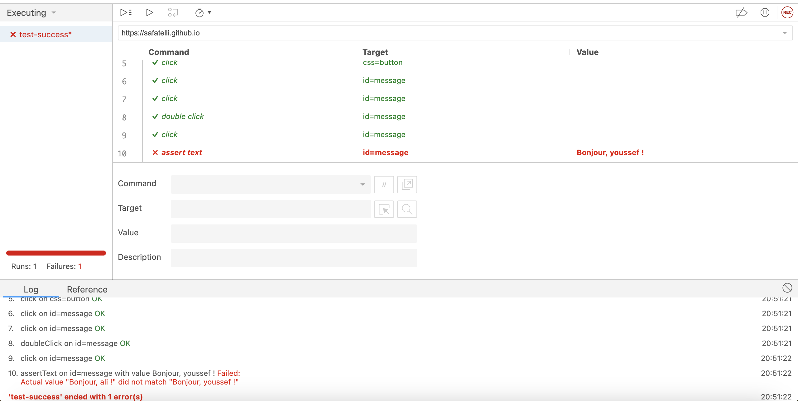

# Exercice 1

## Premier test reussi:


code du script dans test_ex1_success.py

## Second Test échoué:




code du script dans test_ex2_failure.py

## Analyse

Ce resultat est parfaitement normal, puisque le second test, test_ex1_failure.py, execute un assert_text ""Bonjour, ali !" alors que le nom que l'on 
met dans l'input field est: "mahdi" . 

## Solution

Au lieu de hardcoder les input/outputs de ce test, nous pouvons faire un assert_text avec le contenu de l'input field:

```python
assert self.driver.find_element(By.ID, "message").text == "Bonjour, " + self.driver.find_element(By.ID, "username").get_attribute("value") + " !"
```

code dans test_ex1_final.py
